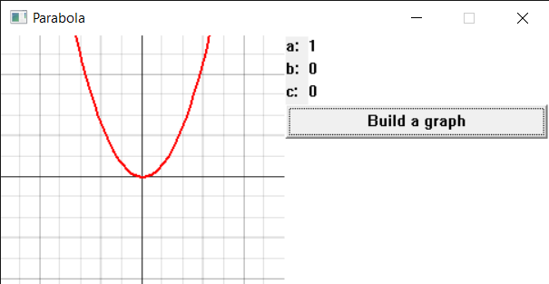

# Parabola

This repository contains files for a Windows program writen on C++ using WinAPI that plots parabolas.

## Opportunities
- You can set the coefficient "a".
- You can set the coefficient "b".
- You can set the coefficient "c".
- You can build a graph.

**To get started, set the coefficients and click the button.**

> The interface is simple and straightforward.

